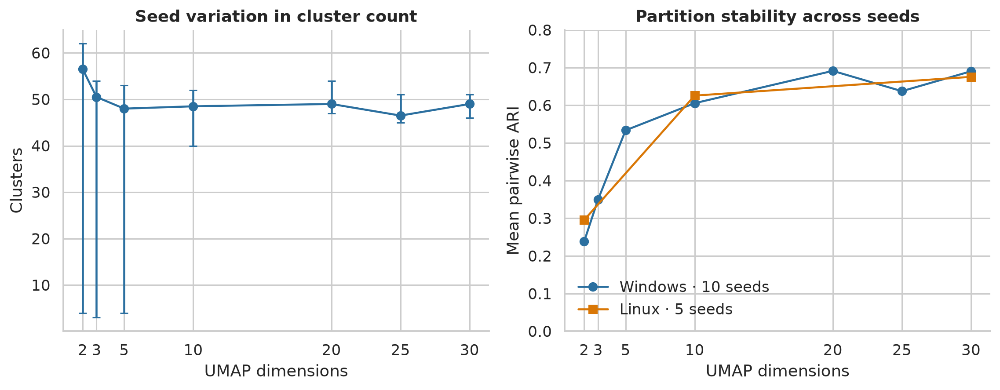
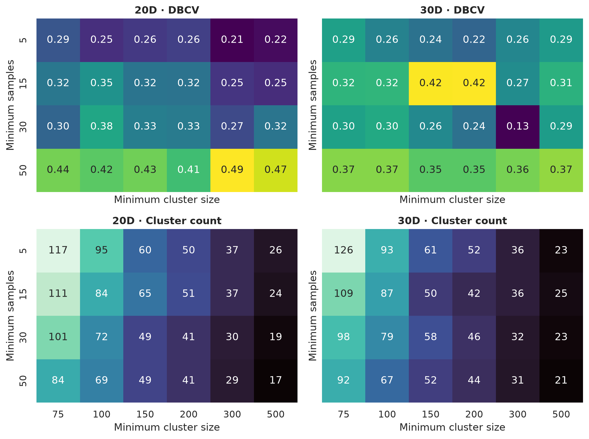
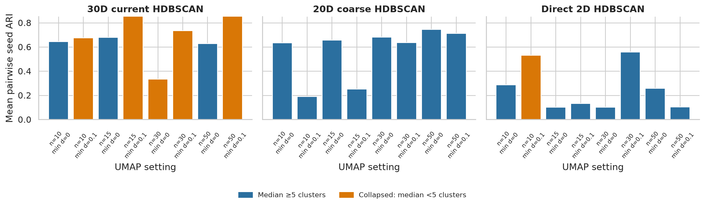
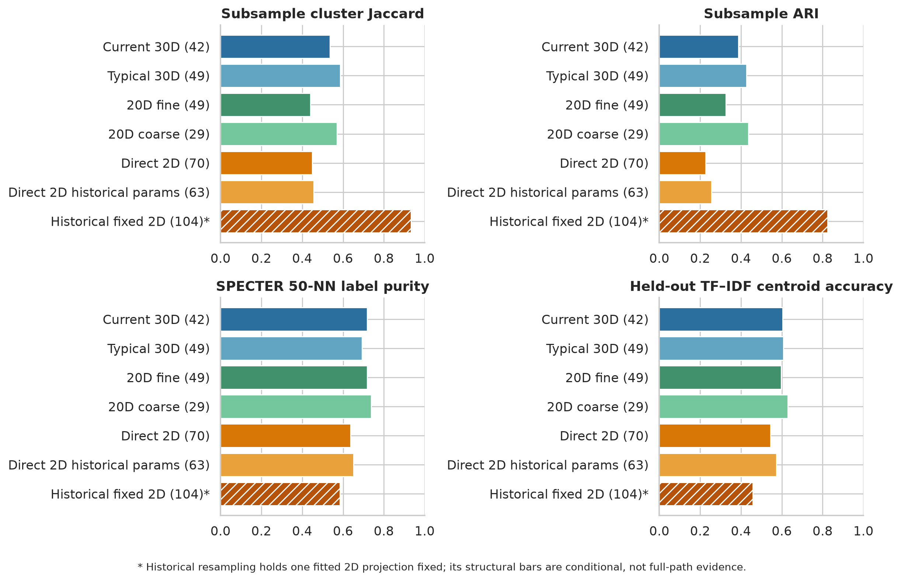
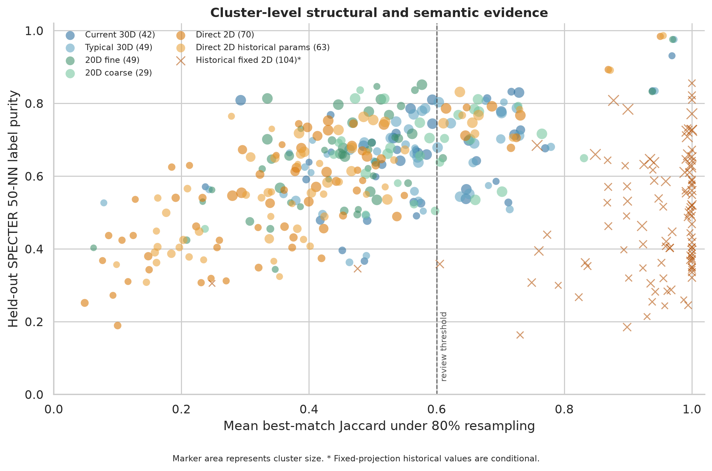

# Robustness of the PhilPapers clustering

Study completed: 27 August 2026

## Summary

This study tests the atlas's present 42-cluster HDBSCAN lens rather than treating a
single fitted partition or internal validity score as decisive. It examines source
provenance, exact reproduction, UMAP randomness and dimension, nearby HDBSCAN and
UMAP settings, PCA dimension, operating system, repeated 80% subsamples, the
original 768-dimensional SPECTER space, and the language of titles and abstracts.

The main conclusions are:

- The published 42-cluster lens is exactly reproducible from its saved canonical
  30D array. It is a defensible exploratory partition, but it is not insensitive
  to a fresh UMAP fit or a fresh sample of papers.
- There is no replicable advantage for clustering directly in two dimensions.
  Independent 2D fits have the weakest seed agreement and weak full-path
  resampling results. The apparently strong historical result is explained by
  evaluation on one fixed display projection, not by a generally superior 2D
  solution.
- Two alternatives deserve serious consideration. The typical 30D medoid has the
  strongest full-path structural result; the coarse 20D/29-cluster lens is nearly
  as stable and has the strongest convergent semantic evidence.
- Stability varies substantially within every lens. In the current lens, compact
  specialist clusters coexist with broad regions that repeatedly split or merge.
  Noise and uncertain boundary papers should not be forced into a cluster.
- The atlas should keep the current 42-cluster lens for continuity while the 30D
  and coarse 20D alternatives receive expert review and names. Direct-2D
  clustering should remain a diagnostic, not become the scientific default.

## The object of study

The current lens contains 69,400 English-language records. Its declared pipeline is:

> SPECTER (768D) → PCA (100D) → UMAP (30D; cosine; 15 neighbours; minimum distance
> 0; seed 42) → HDBSCAN (minimum cluster size 200; minimum samples 15; EOM).

HDBSCAN assigns 48,119 papers to 42 clusters and leaves 21,281 papers (30.664%) as
noise. The 2D atlas map is a separate display projection. It is not the space in
which the current 42 clusters were fitted.

There is no labelled subject taxonomy against which to score these partitions. The
metadata workbook's `subject` field contains “Philosophy” for 69,399 of the 69,400
matched records and is therefore uninformative. This is an unsupervised robustness
study, not a measurement of classification accuracy against ground truth.

## Protocol and decision rule

The protocol and structural finalist rules were written before held-out semantic
results were inspected. Full details are in [PLAN.md](PLAN.md); the exact parameter
sets and seeds are in [config.yaml](config.yaml). The study does not create a
weighted “best clustering” score. It reports four distinct forms of evidence:

1. exact reproducibility of the reference fit;
2. global and cluster-wise stability under seeds, settings, platforms and subsamples;
3. separation and neighbourhood agreement in the unreduced SPECTER space;
4. coherence and separability in titles and abstracts.

No one measure establishes a true taxonomy. In particular, DBCV is an internal
density-validity measure in the fitted representation. Values calculated in 2D,
20D and 30D are not measurements on a common geometry and cannot be read as if the
largest number identified the truest partition. Hennig's cluster-wise stability
principle is used because a globally respectable partition can contain both robust
and fragile clusters.

## Provenance and exact reproduction

The source audit found two distinct UMAP lineages with identical visible
hyperparameters:

- A May display lineage used the recovered PCA100 array, an unseeded 30D UMAP, and
  then a 2D UMAP for display.
- A June/July clustering lineage regenerated 20D, 25D and 30D UMAPs with seed 42 and
  `low_memory=False`. The published 42 labels were fitted on this later 30D array.

The two branches use byte-identical PCA100 data but different UMAP30 coordinates.
Their local structure is related rather than identical: mean neighbour overlap is
0.593 at 15 neighbours and 0.706 at 50. Both have approximately 0.966
trustworthiness relative to PCA100 on the same 4,000-paper audit sample. Similar
trustworthiness therefore does not imply similar density clustering.

Refitting HDBSCAN(200, 15) on the later canonical UMAP30 reproduces every published
label exactly (ARI 1.000), including 42 clusters, 30.664% noise and DBCV
0.4215738883. The same HDBSCAN fit on the earlier UMAP30 produces four clusters,
0.071% noise, DBCV 0.11794 and ARI 0.00684 to the published partition. Row order is
exactly aligned for all 69,400 atlas records.

This is not a minor archival detail. The result establishes that the current labels
are reproducible from the correct saved array, while also showing that the earlier
unseeded representation belongs to a different analytical branch.

## Seed and dimension sensitivity

Seventy new PCA100→UMAP fits crossed seven output dimensions with ten seeds. Each
was followed by HDBSCAN(200, 15). The table reports medians across runs and mean
agreement over every seed pair.

| UMAP dimensions | Median clusters (range) | Median noise | Median DBCV | Mean pairwise ARI | Mean weighted cluster Jaccard |
|---:|---:|---:|---:|---:|---:|
| 2 | 56.5 (4–62) | 28.92% | 0.290 | 0.238 | 0.450 |
| 3 | 50.5 (3–54) | 31.35% | 0.274 | 0.349 | 0.510 |
| 5 | 48.0 (4–53) | 34.52% | 0.284 | 0.533 | 0.635 |
| 10 | 48.5 (40–52) | 34.42% | 0.266 | 0.606 | 0.730 |
| 20 | 49.0 (47–54) | 36.33% | 0.291 | 0.691 | 0.793 |
| 25 | 46.5 (45–51) | 34.43% | 0.281 | 0.637 | 0.770 |
| 30 | 49.0 (46–51) | 35.47% | 0.275 | 0.690 | 0.803 |

The dimensional pattern is clear. At 20–30 dimensions the number of clusters is
fairly stable and mean pairwise ARI is about 0.64–0.69. At 2D it falls to 0.238;
one seed collapses to four clusters. Three- and five-dimensional runs also contain
collapsed solutions. This is evidence against a general claim that direct 2D makes
the PhilPapers density structure easier to recover. A particular 2D projection can
make density contrasts sharper, but the resulting partition is much more dependent
on the stochastic projection.

The Linux replication gives the same ordering. Across five independently fitted
seeds, mean pairwise ARI is 0.295 in 2D, 0.626 in 10D and 0.675 in 30D. Same-seed
Windows/Linux agreement is weakest in 2D and strongest in 30D. Even the Linux
seed-42 30D reconstruction is not identical to the saved canonical array: its
coordinates correlate at 0.999907 after direct flattening, but its HDBSCAN labels
have ARI 0.627 to the canonical labels. Very small numerical changes can move
density boundaries even when an embedding looks practically unchanged.

## HDBSCAN, PCA and UMAP parameter sensitivity

The PCA100 HDBSCAN grid contains 175 fits across all seven dimensions, six minimum
cluster sizes, four minimum-samples values and an EOM/leaf check. The current
30D(200, 15) cell has the highest DBCV in the 30D grid (0.4216), 42 clusters and
30.66% noise. Its mean ARI to adjacent grid cells is 0.709 (minimum 0.584): it is a
defensible 30D setting, but not invariant to nearby density thresholds.

At 20D, two different resolutions are structurally plausible. HDBSCAN(150, 50)
produces 49 clusters and has high adjacent-cell agreement (mean ARI 0.892).
HDBSCAN(300, 50) produces 29 clusters, DBCV 0.4943 and mean adjacent-cell ARI
0.788. They were retained as fine and coarse finalists rather than collapsed into
one ranking.

Reducing PCA to 50 dimensions does not improve the general result. At UMAP20 and
UMAP30, several of the nine seed tests collapse to two to four dominant clusters.
PCA50→UMAP25 is more stable (three-seed mean ARI 0.723), but the wider PCA50 grid
contains 8–11 degenerate EOM cells per dimension. PCA100 remains the more reliable
starting point for these lenses.

The 72-cell UMAP-parameter study shows that `n_neighbors` and `min_dist` matter as
much as the nominal output dimension. Setting minimum distance to 0.1 often
collapses the fit to two to four clusters. At minimum distance 0, the coarse 20D
configuration is the most consistent of the tested candidates as neighbourhood
size varies: its three-seed mean ARI ranges from 0.636 to 0.746 for 10–50
neighbours. The fine 20D and current 30D configurations are stable for some
neighbourhood sizes but collapse in some 30- or 50-neighbour runs. Direct 2D remains
the least consistent non-degenerate family.

## Reassessing the apparently strong 2D result

The historical 104-cluster lens was selected on one fixed 2D display with a custom
balanced score of 0.795. That score combined 2D silhouette (0.419), parameter
agreement (ARI 0.818), coverage (84.47%) and membership strength (mean 0.905). It
was not DBCV, and it was not evaluated across independently fitted 2D UMAPs.
Silhouette in the same 2D space used for clustering especially measures the
separations created by that projection.

To avoid comparing unlike configurations, the historical scikit-learn HDBSCAN
settings (minimum cluster size 150, minimum samples 50) were subsequently fixed and
replicated across all independent 2D seeds and the same full-path subsamples. This
clarification was made before semantic validation. The original frozen map is also
retained, but its resampling result is labelled conditional: subsampling coordinates
from one fixed projection cannot establish reproducibility of the projection itself.

Across ten Windows seeds, the historical HDBSCAN parameters produce a median of 63
clusters but a range of 7–72; mean pairwise ARI is 0.272 and the minimum is 0.0026.
The five Linux fits avoid a complete collapse but still have mean pairwise ARI only
0.314. Across all fifteen runs, mean pairwise ARI is 0.292 and mean weighted cluster
Jaccard is 0.494. Their mean ARI to the historical 104-cluster partition is 0.144
(maximum 0.186). Applying the same HDBSCAN settings therefore does not recover the
historical partition on independent direct-2D projections.

The empirical question is therefore not whether HDBSCAN *can* return an attractive
score after UMAP to 2D—it can, and this is compatible with lower-dimensional density
estimation. The question is whether the same substantive partition survives new
draws of the 2D manifold. The seed experiment supplies the relevant answer.

## Full-path subsampling

Twenty deterministic 80% subsets were used for every finalist. Each subset was
rebuilt from the original embeddings: PCA was refitted to 100 dimensions from the
normalised 768D SPECTER vectors, followed by new UMAP and HDBSCAN fits. A separate
fixed-PCA pass isolates the additional
variation introduced by PCA estimation. The primary analysis scaled minimum cluster
size by 0.8; the secondary analysis left it fixed. The same paper subsets were used
across configurations, making comparisons paired. Each full-data cluster was
matched to its most similar resampled cluster by Jaccard overlap on shared papers.

A run with fewer than five clusters is reported as a collapse. The all-run columns
are the primary result: excluding collapses after observing them would conceal an
important failure mode. Non-collapsed means are included as a diagnostic showing
how well a configuration behaves when it returns a usable partition.

| Lens | Collapses / 20 | Mean weighted cluster Jaccard, all / non-collapsed | Mean ARI, all / non-collapsed | Mean mapped paper agreement | Papers with assignment consistency < 0.5 |
|---|---:|---:|---:|---:|---:|
| Current 30D / 42 | 3 | 0.536 / 0.619 | 0.387 / 0.455 | 0.631 | 25.0% |
| Typical 30D / 49 | 3 | **0.587** / **0.684** | 0.427 / 0.501 | **0.661** | 19.8% |
| Fine 20D / 49 | 7 | 0.440 / 0.644 | 0.327 / 0.500 | 0.536 | 30.7% |
| Coarse 20D / 29 | 3 | 0.570 / 0.656 | **0.437** / **0.514** | 0.657 | **18.0%** |
| Direct 2D / 70 | 2 | 0.449 / 0.496 | 0.227 / 0.252 | 0.537 | 43.0% |
| Direct 2D, historical parameters / 63 | 1 | 0.456 / 0.478 | 0.256 / 0.269 | 0.540 | 38.8% |

The typical 30D and coarse 20D lenses form the leading structural pair. Typical
30D has the highest all-run weighted Jaccard and mapped paper agreement; coarse 20D
has the highest all-run ARI and the smallest share of papers with consistency below
one half. Fine 20D is respectable after collapsed runs are removed, but collapsing
in seven of twenty full refits is itself decisive evidence against treating it as
the robust 20D choice. Both direct-2D configurations remain weak even after their
collapsed runs are excluded.

The fixed-PCA diagnostic does not overturn this result. It gives weighted Jaccard
0.583 for typical 30D and 0.627 for coarse 20D. Refitting PCA changes these to
0.587 and 0.570 respectively, showing that PCA estimation contributes non-trivial
variation for the 20D solutions. The current 30D result changes only from 0.527 to
0.536. A full-path study was therefore necessary; holding PCA fixed would have
made the coarse lens look more secure than it is.

On the historical 2D coordinates held fixed, resampling gives mean weighted
Jaccard 0.934, ARI 0.825 and mapped assignment agreement 0.945. Those values show
that HDBSCAN is repeatable *conditional on that map*. They cannot be compared as
full-pipeline stability evidence because neither UMAP nor PCA is refitted. The
independent direct-2D results above supply that missing test and do not reproduce
the apparent advantage.

## Held-out semantic validation

Finalists were frozen before semantic results were calculated. A deterministic
6,000-paper validation set was selected from hashed paper IDs; 4,000 separate
development records were also frozen. Approximate 15- and 50-nearest neighbours
were constructed in the original, L2-normalised 768D SPECTER space and audited
against exact neighbours for 500 validation queries. Original-space centroid and
cosine-silhouette diagnostics use the held-out records.

Titles and abstracts were represented by TF–IDF unigrams and bigrams fitted without
the validation papers. The principal held-out text measure is nearest-centroid
assignment accuracy. Top terms, term exclusivity and NPMI are interpretive
diagnostics rather than external labels. One hundred random permutations per lens
preserve every cluster size and the noise fraction, providing a null distribution
for SPECTER neighbour agreement.

The approximate index is effectively exact for this purpose: mean recall is 0.9985
at 15 neighbours and 0.9974 at 50 on the 500-query exact audit; the minimum recalls
are 0.933 and 0.940.

| Lens | SPECTER 50-NN purity | SPECTER centroid accuracy | TF–IDF centroid accuracy | Text NPMI | SPECTER silhouette |
|---|---:|---:|---:|---:|---:|
| Current 30D / 42 | 0.718 | 0.779 | 0.605 | 0.048 | −0.019 |
| Typical 30D / 49 | 0.693 | **0.820** | 0.608 | 0.040 | 0.029 |
| Fine 20D / 49 | 0.718 | 0.791 | 0.596 | 0.051 | −0.019 |
| Coarse 20D / 29 | **0.738** | 0.793 | **0.630** | **0.063** | 0.014 |
| Direct 2D / 70 | 0.636 | 0.785 | 0.545 | 0.046 | 0.048 |
| Direct 2D historical parameters / 63 | 0.651 | 0.802 | 0.574 | 0.040 | **0.057** |
| Historical fixed 2D / 104 | 0.585 | 0.664 | 0.459 | −0.002 | −0.039 |

Every lens has far more SPECTER neighbour agreement than its size-preserving null;
all empirical one-sided values are at the 100-permutation resolution limit
(`p = 1/101`). Thus every partition contains semantic signal. The comparison among
lenses is more discriminating. The coarse 20D lens has the best original-space
neighbour purity, held-out text accuracy and text coherence. The typical 30D medoid
has the best SPECTER nearest-centroid accuracy. The current 42-cluster lens and fine
20D lens are close on neighbour purity, with the current lens modestly better on
held-out text assignment.

The independently fitted direct-2D lenses are coherent but weaker on local SPECTER
and text evidence. The fixed historical 104-cluster lens is weakest on every
semantic measure except raw centroid cohesion, which is strongly affected by the
high common cosine similarity of SPECTER vectors. Its text NPMI is slightly
negative. Cosine silhouette is small for every lens (−0.039 to 0.057), confirming
that the corpus is not composed of cleanly separated spherical groups in the
original space. No substantive decision rests on silhouette alone.

## Cluster-level audit and uncertain boundaries

Global values conceal pronounced cluster-to-cluster variation. The table counts
clusters whose mean best-match Jaccard is below the descriptive review threshold
of 0.60. The first count includes every resample; the second excludes collapsed
runs. Assignment consistency is the proportion of resamples in which a paper
returns to its mapped reference assignment, including the noise assignment.

| Lens | Clusters below 0.60, all runs | Clusters below 0.60, non-collapsed runs | Papers below 0.5 consistency |
|---|---:|---:|---:|
| Current 30D / 42 | 27 / 42 | 13 / 42 | 25.0% |
| Typical 30D / 49 | 31 / 49 | 17 / 49 | 19.8% |
| Fine 20D / 49 | 46 / 49 | 16 / 49 | 30.7% |
| Coarse 20D / 29 | 17 / 29 | 9 / 29 | 18.0% |
| Direct 2D / 70 | 61 / 70 | 61 / 70 | 43.0% |
| Direct 2D, historical parameters / 63 | 53 / 63 | 53 / 63 | 38.8% |

The current lens illustrates why the audit must remain cluster-wise. Neutrosophic
Logic has mean resampling Jaccard 0.969, paper consistency 0.995 and SPECTER 50-NN
purity 0.931. Biomedical Ontology is also comparatively stable (Jaccard 0.770;
paper consistency 0.850). At the other end, Phenomenology
(Husserl/Merleau-Ponty) has Jaccard 0.238 and consistency 0.320. The large Political
& Social Philosophy cluster has high SPECTER neighbourhood purity (0.809) but low
Jaccard (0.293) and consistency (0.431): it is a coherent broad region whose exact
boundary repeatedly splits or merges.

Numerical stability is not sufficient for a philosophically useful category. The
current “OCR/Font Artifacts” cluster is structurally stable (Jaccard 0.938) and
locally concentrated in SPECTER space (purity 0.834), yet its held-out text NPMI is
−0.247 and its representative papers do not support a clean substantive topic.
It requires source and naming review rather than automatic endorsement. The audit
therefore also flags SPECTER purity below 0.40 and text NPMI below −0.10. These are
triage thresholds, not hypothesis tests. The full 406-row table records descriptors,
top terms, representative titles, confidence intervals and each reason for review.

The fixed historical 104-cluster lens looks stable only in the conditional
fixed-map test, yet 37 of its clusters have SPECTER 50-NN purity below 0.40 and 24
have text NPMI below −0.10. Forty-five of 104 meet at least one review condition.
This mismatch between conditional structural persistence and original-space or
text evidence is further reason not to promote the historical lens as the primary
taxonomy.

## Interpretation

UMAP is useful here because density estimation in hundreds of dimensions is
difficult, but it does not preserve density exactly and can introduce artificial
tears. The UMAP documentation itself advises care when using the representation for
clustering, recommends exploring dimensions and parameters, and distinguishes a
clusterable embedding from a display embedding. Its reproducibility documentation
also stresses that a fixed seed makes a stochastic result repeatable; it does not
show that conclusions are insensitive to the random draw.

HDBSCAN's noise assignments should be retained. They mark papers for which the
chosen density lens does not provide a stable topic assignment. The grey regions in
the atlas can still contain semantically related papers: local relatedness is not
the same as membership in a sufficiently persistent density component, and a
projection can place boundary papers near a visible coloured cluster.

## Recommendations

1. Keep the current 42-cluster lens selected in the public atlas for now. Its
   labels have been reviewed, its saved fit is exactly reproducible, and it carries
   real semantic signal. Describe it as one exploratory lens rather than as the
   uniquely preferred solution.
2. Prepare the typical 30D/49-cluster and coarse 20D/29-cluster finalists for the
   atlas after a manual naming and representative-paper audit. The former is the
   strongest structural candidate; the latter offers the best balance of structural
   stability, SPECTER locality and text coherence. Neither should be chosen by a
   hidden composite score.
3. Do not make direct-2D HDBSCAN a primary lens. Keep the common 2D projection for
   visual comparison and the 3D projection for exploration, while fitting the
   scientific clustering in the higher-dimensional analysis representation.
4. Surface uncertainty at cluster and paper level. Cluster panels can report a
   compact stability band and link to representative papers; boundary papers can
   use resampling assignment consistency rather than an invented confidence value.
   Noise should remain visible and selectable.
5. Version every production lens with hashes of the source ordering, PCA array,
   UMAP array, labels, package versions and random seed. Parameters alone do not
   reproduce these results across machines.
6. Before changing the default lens, conduct a blinded expert audit on a stratified
   sample from stable cores, unstable boundaries, noise, and the largest clusters.
   Multi-label judgements are preferable because philosophical areas overlap. This
   is the principal evidence still missing from a purely unsupervised study.

## Limitations

- The corpus has no independent, multi-label philosophical subject taxonomy. All
  semantic tests demonstrate coherence and separability, not a uniquely correct
  classification.
- SPECTER embeddings and text derive from the same documents. Agreement between
  them is useful convergent evidence, but it is not independent human validation.
- UMAP is stochastic and numerically sensitive across platforms. Saved arrays and
  labels, not parameters alone, are required for exact atlas reproduction.
- The historical fixed-display resampling is conditional on one projection and is
  not commensurable with full-path resampling.
- A paper may reasonably belong to several philosophical areas. A hard HDBSCAN
  label hides that overlap; the atlas should present clusters as exploratory lenses.
- Cluster-wise thresholds are descriptive audit aids. They are not formal tests of
  ontological reality.

## Reproduction and records

All compact results, figures and manifests are under [`results/`](results/). Large
embeddings and checkpoint arrays are excluded from Git under `work/`. The source
manifest records hashes, shapes and provenance. The pinned environment and exact
commands are documented in [REPRODUCING.md](REPRODUCING.md).

The principal scripts are:

- `scripts/robustness_study.py`: provenance audit, seed/dimension scan and HDBSCAN grid;
- `scripts/remote_seed_replication.py`: Linux replication;
- `scripts/robustness_followup.py`: UMAP sensitivity and subsampling;
- `scripts/robustness_2d_replication.py`: direct-2D replication of historical settings;
- `scripts/robustness_semantic.py`: original-space, text and consensus validation;
- `scripts/robustness_finalize.py`: merged audit table, figures and integrity checks.

## Methodological references

- UMAP, [Using UMAP for clustering](https://umap-learn.readthedocs.io/en/latest/clustering.html).
- UMAP, [Reproducibility](https://umap-learn.readthedocs.io/en/latest/reproducibility.html).
- McInnes, Healy and Astels, [*hdbscan: Hierarchical density based clustering*](https://joss.theoj.org/papers/10.21105/joss.00205) (2017).
- Moulavi et al., [*Density-Based Clustering Validation*](https://www.imada.sdu.dk/~zimek/publications/SDM2014/DBCV.pdf) (2014).
- Hennig, [*Cluster-wise assessment of cluster stability*](https://www.homepages.ucl.ac.uk/~ucakche/papers/clusta.pdf) (2007).
- Monti et al., [*Consensus Clustering*](https://www.cs.utexas.edu/~ml/biodm/papers/MLJ-biodm2.pdf) (2003).
- Gagolewski, Bartoszuk and Cena, [*Are cluster validity measures (in)valid?*](https://www.sciencedirect.com/science/article/pii/S0020025521010082) (2021).
